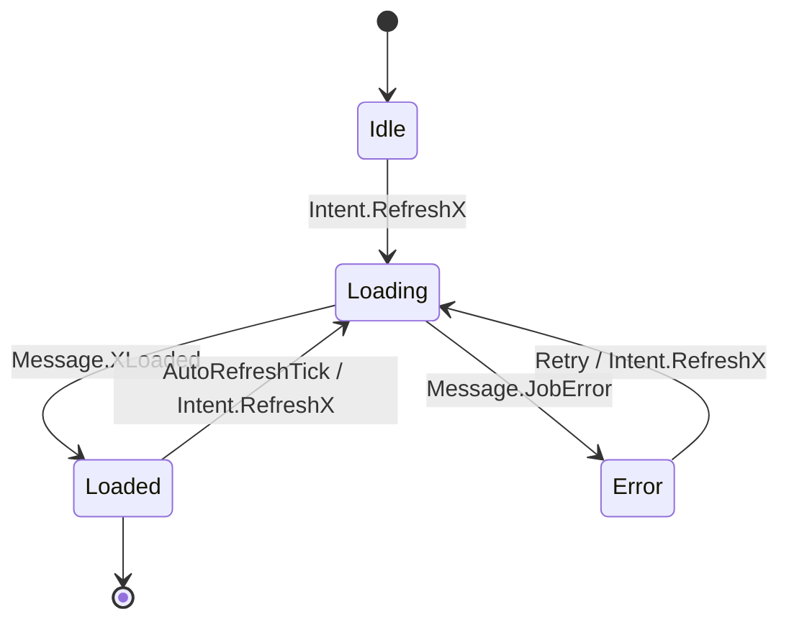

# Project Structure

```text
./
|-- cmd/
|   |-- awscbtui/
|       |-- main.go
|
|-- pkg/
|   |-- ui/
|   |   |-- app.go
|   |   |-- layout.go
|   |   |-- keymap.go
|   |   |-- navigation.go
|   |   |-- render/
|   |       |-- projects.go
|   |       |-- builds.go
|   |       |-- details.go
|   |       |-- logs.go
|   |       |-- status.go
|   |       |-- help.go
|   |
|   |-- state/
|   |   |-- state.go
|   |   |-- intents.go
|   |   |-- reducer.go
|   |   |-- selectors.go
|   |   |-- messages.go
|   |
|   |-- jobs/
|   |   |-- dispatcher.go
|   |   |-- types.go
|   |   |-- timers.go
|   |
|   |-- aws/
|   |   |-- session.go
|   |   |-- codebuild.go
|   |   |-- logs.go
|   |   |-- types.go
|   |   |-- fake/
|   |       |-- codebuild_fake.go
|   |       |-- logs_fake.go
|   |
|   |-- config/
|   |   |-- load.go
|   |   |-- appconfig.go
|   |
|   |-- logging/
|   |   |-- commandlog.go
|   |   |-- slog_adapter.go
|   |
|   |-- util/
|   |   |-- ringbuffer.go
|   |   |-- debounce.go
|   |   |-- backoff.go
|   |   |-- copy.go
|
|-- test/
|   |-- reducer_test.go
|   |-- intents_test.go
|   |-- aws_fakes_test.go
|   |-- ui_headless_test.go
|
|-- docs/
|   |-- DESIGN.md
|   |-- PLAN.md
|   |-- STRUCTURE.md
|
|-- go.mod
|-- go.sum
|-- README.md
```


Here are AI notes on the structure and what each part is for, plus some Go tips as you work.

Top level

    go.mod / go.sum: Tracks your module name and dependencies. Always run go mod tidy after adding imports to keep these clean.
    README.md: What the project does and how to run it. Keep it short but useful.
    docs/: Longer docs like design, plan, and structure. Useful for future you.

cmd/awscbtui/

    main.go: The entry point. Keep it tiny—just create the app and run it.
    Rule of thumb: cmd/<appname> contains small wrappers; all logic lives under pkg/.

pkg/ui/

    app.go: Creates the gocui Gui, holds the main loop, wires everything together. One place to initialize state, dispatcher, and keybindings.
    layout.go: Defines panels/views (projects, builds, bottom tabs, status bar). Only draw; do not fetch data here.
    keymap.go: Maps keys (e.g., j/k/r/?) to “intents” (events). Keep it declarative and consistent.
    navigation.go: Tracks which panel is focused and how Tab/Shift-Tab move focus.
    render/: Pure functions that take state and write strings to views. They should not call AWS or spawn goroutines. Keep rendering pure and predictable.

Why: Separating UI rendering from logic makes it easier to test and reason about. If the UI isn’t updating, you check state first, then rendering.

pkg/state/

    state.go: The AppState struct—your single source of truth. Contains session, UI focus, caches (projects, builds), etc.
    intents.go: Definitions of user actions and async events (e.g., RefreshProjects, BuildsLoaded). Usually a small enum + payload structs.
    reducer.go: Pure functions that take (state, intent) and return a new or mutated state. This keeps logic predictable and testable.
    selectors.go: Helpers to read derived values from state (e.g., current selected project). Keeps UI code simple.
    messages.go: Defines the messages your jobs send back (e.g., Loaded, Error, PartialResult).

Why: Treat state transitions as “reducers” (inspired by Redux). Easier to test: given input state + intent => expected state.

pkg/jobs/

    dispatcher.go: Runs background jobs (goroutines) and sends results back via channels. Handles deduping, debouncing, and cancellation.
    types.go: Keys and metadata to identify jobs (e.g., {Service: CodeBuild, Scope: ProjectName}).
    timers.go: Tickers for auto-refresh logic.
    Tip: Always pass context.Context to jobs so you can cancel them when profile/region/focus changes.

Why: Never block the UI. Offload network calls to workers, and communicate via channels.

pkg/aws/

    session.go: Loads AWS config/credentials (respects env vars, profiles), exposes an AWS config object and identity info. Handle SSO prompts here.
    codebuild.go: Thin wrappers around AWS SDK v2 calls for CodeBuild: ListProjects, ListBuildsForProject, BatchGetBuilds. Convert SDK types to your own DTOs.
    logs.go: CloudWatch Logs tailer logic (GetLogEvents with nextToken). Expose a function that returns new lines and a next cursor.
    types.go: Your DTOs (Project, Build, BuildPhase, LogLine). Keep these simple Go structs.
    fake/: Fake implementations used by tests so you don’t hit AWS during unit tests.

Why: Isolate the SDK. If the SDK changes, only this folder changes. The rest of the app uses your stable DTOs.

pkg/config/

    load.go: Loads ~/.aws for auth (via the SDK) and your app’s own config file (e.g., ~/.config/awscbtui/config.yml).
    appconfig.go: Struct that holds app settings (keybindings override, refresh intervals).
    Tip: Provide sensible defaults if no config file exists.

pkg/logging/

    commandlog.go: A thread-safe buffer storing recent “commands” your app executed (e.g., CodeBuild.ListProjects … took 120ms). The UI reads this for the command log panel.
    slog_adapter.go: Optional integration with Go’s slog or other loggers for debugging.

pkg/util/

    ringbuffer.go: A fixed-size buffer for log tail lines so memory doesn’t grow forever.
    debounce.go: Utility to delay jobs slightly to avoid spamming AWS on rapid keypresses.
    backoff.go: Exponential backoff with jitter to handle throttling/network errors gracefully.
    copy.go: Cross-platform clipboard helper (optional nice-to-have).

test/

    reducer_test.go: Tests for state transitions—fast and reliable.
    intents_test.go: Tests that intents do the right thing to the state.
    aws_fakes_test.go: Tests for your AWS wrappers using fakes (no real AWS calls).
    ui_headless_test.go: Optional; simulate key presses and assert state changes without drawing the actual UI.


## Data Flow

```mermaid
flowchart LR
  subgraph UI[gocui UI]
    KB[Keybindings<br/>(keymap.go)]
    NAV[Navigation<br/>(navigation.go)]
    REND[Renderers<br/>(render/*.go)]
    HELP[Help Overlay]
  end

  subgraph STATE[State Layer]
    S[AppState<br/>(state.go)]
    RED[Reducer<br/>(reducer.go)]
    SEL[Selectors<br/>(selectors.go)]
    INT[Intents<br/>(intents.go)]
    MSG[Messages<br/>(messages.go)]
  end

  subgraph JOBS[Async Jobs]
    DISP[Dispatcher<br/>(dispatcher.go)]
    TIM[Timers/Auto-refresh<br/>(timers.go)]
    JMETA[Job Keys/Meta<br/>(types.go)]
  end

  subgraph AWS[AWS Integration]
    SES[Session/Identity<br/>(session.go)]
    CB[CodeBuild API<br/>(codebuild.go)]
    CWL[CloudWatch Logs<br/>(logs.go)]
    FAKES[Fakes (tests)<br/>(aws/fake/*)]
  end

  subgraph UTIL[Utilities]
    RB[RingBuffer<br/>(util/ringbuffer.go)]
    BO[Backoff/Jitter<br/>(util/backoff.go)]
    DEB[Debounce<br/>(util/debounce.go)]
    CLIP[Clipboard<br/>(util/copy.go)]
  end

  subgraph LOG[Command Log]
    CMD[CommandLog Buffer<br/>(logging/commandlog.go)]
  end

  %% User input -> intents
  KB -->|keypresses| INT
  NAV --> INT
  HELP --> INT

  %% Intents to Reducer (sync)
  INT --> RED
  RED --> S
  S --> SEL
  SEL --> REND
  REND -->|pure render| UI

  %% Intents that start async work
  INT -->|dispatch request| DISP
  TIM -->|tick| DISP
  DISP -->|uses| JMETA
  DISP -->|ctx with cancel<br/>backoff/debounce| AWS

  %% AWS calls and results
  AWS -->|DTOs| MSG
  SES -. provides cfg .-> CB
  SES -. provides cfg .-> CWL
  CB --> MSG
  CWL --> MSG

  %% Messages back to state/UI
  MSG --> RED
  MSG --> CMD
  DISP --> CMD
  INT --> CMD

  %% Utilities used by jobs/UI
  CWL -->|log lines| RB
  DISP -. uses .-> BO
  DISP -. uses .-> DEB
  UI -. optional .-> CLIP

  %% Session changes cancel jobs
  SES -. profile/region change cancels ctx .-> DISP

  %% Rendering reads state only
  S --> REND

  %% Status bar pulls identity/session
  SES --> UI
  CMD --> UI
```

## Event Loop
```mermaid
sequenceDiagram
  participant User
  participant UI as gocui UI<br/>(app.go)
  participant KM as Keymap<br/>(keymap.go)
  participant INT as Intent<br/>(intents.go)
  participant RED as Reducer<br/>(reducer.go)
  participant S as AppState<br/>(state.go)
  participant DISP as Dispatcher<br/>(dispatcher.go)
  participant AWS as AWS Wrappers<br/>(codebuild.go, logs.go)
  participant MSG as Message<br/>(messages.go)
  participant R as Renderers<br/>(render/*.go)
  participant CMD as CommandLog

  User->>UI: keypress (e.g., "r" RefreshBuilds)
  UI->>KM: lookup binding
  KM->>INT: create RefreshBuilds(project)
  INT->>RED: handle intent (pure)
  RED->>S: mutate state (e.g., set loading=true)
  RED->>CMD: append "intent: RefreshBuilds"

  rect rgba(200,200,255,0.2)
    INT->>DISP: dispatch job (ctx, jobKey)
    DISP-->>UI: return immediately (non-blocking)
    par Worker goroutine
      DISP->>AWS: ListBuildsForProject + BatchGetBuilds
      AWS-->>DISP: DTOs ([]Build)
      DISP->>MSG: BuildsLoaded(project, builds)
      DISP->>CMD: "AWS: ListBuildsForProject took 120ms"
    end
  end

  MSG->>RED: apply message
  RED->>S: update caches (buildsByProject), loading=false
  RED->>CMD: append "BuildsLoaded ok (n=25)"

  UI->>R: render pass (projects/builds/status/logs)
  R-->>UI: write view buffers (pure read from S)

  Note over UI,S: UI thread remains single-threaded.<br/>All state mutations via reducer.

  opt Auto-refresh tick
    DISP->>DISP: timer fires (15s)
    DISP->>INT: emit RefreshBuilds(project)
    INT->>RED: set loading or update lastRequested
    INT->>DISP: re-dispatch with debounce/backoff
  end

  opt Log tailing
    User->>UI: "t" TailLogs(buildID)
    UI->>INT: TailLogs(buildID)
    INT->>RED: set tailing=true; create ring buffer
    INT->>DISP: start tail worker (1–2s poll)
    loop every 1–2s
      DISP->>AWS: GetLogEvents(nextToken)
      AWS-->>DISP: lines, nextToken
      DISP->>MSG: LogsAppended(buildID, lines)
      MSG->>RED: append to ring buffer in state
      UI->>R: re-render Logs tab
    end
  end

  opt Context change (profile/region)
    User->>UI: switch profile/region
    UI->>INT: ChangeProfile/ChangeRegion
    INT->>RED: update session target; clear caches
    DISP->>DISP: cancel all job contexts
    DISP->>SES: load new config/identity
    SES-->>DISP: cfg/identity or error
    DISP->>MSG: SessionUpdated or JobError
    MSG->>RED: update session/error; show toast
    UI->>R: re-render status bar and panels
  end
```

## State Lifecycle

